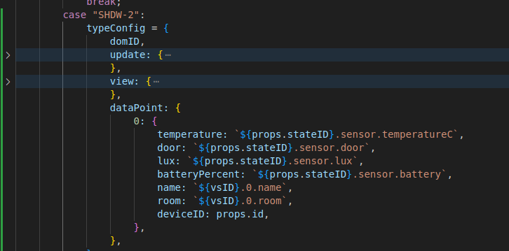
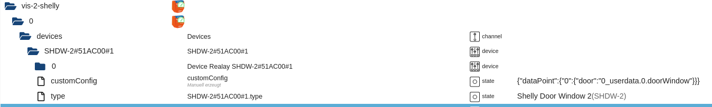
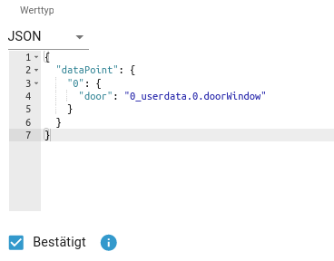

# Modify Device config

The config of all devices are made in a JSON file. See <a href="../src-widgets/src/components/DeviceConfig.jsx">config file</a>

Why you should modify the config or data Points? If you use a script for a custom calculation you have to use a other data point. It is also possible to integrate an not supportet or an not shelly device. 

 
(Example for the JSON file)  
(Add state for customConfig)  
(To set the "door" dataPoint from "shelly.0.SHDW-2#51AC00#1" to "0_userdata.0.doorWindow")  
