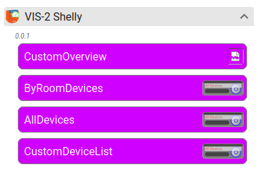
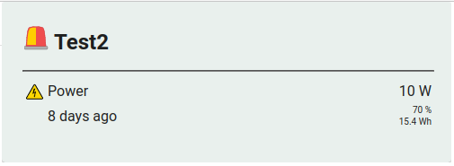
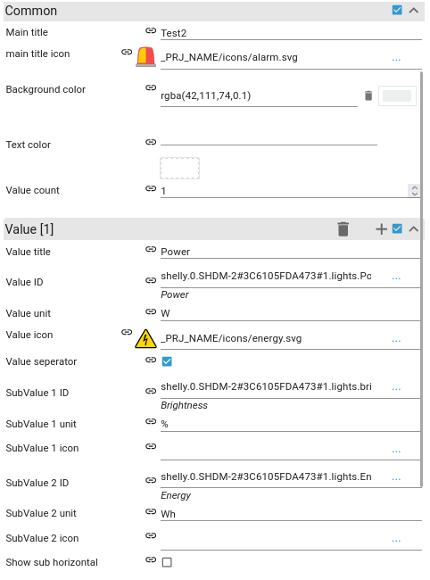
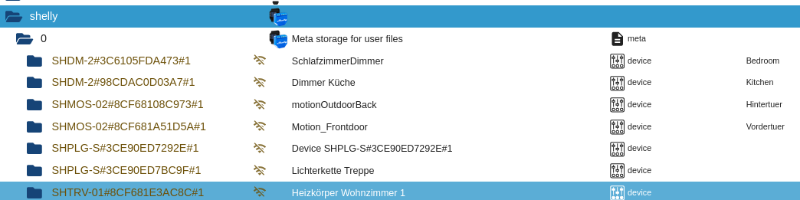
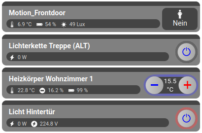
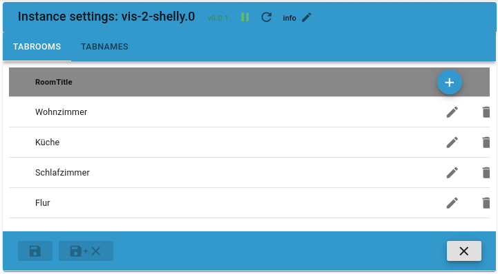
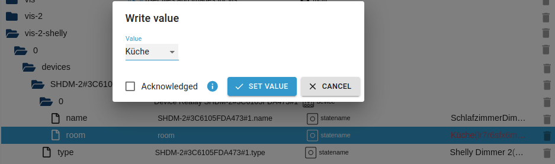
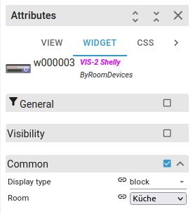
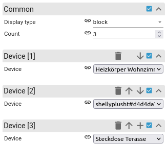

# Documentation (Version 0.0.1)

### Widgets

-   CustomOverview
-   AllDevices
-   RoomDevices
-   CustomDeviceList

## Usage

### CustomOverview

The CustomOverview can be used to show custom Data as an overview.
You can define a Main Title and multible sub values

### AllDevices

The AllDevices will automatic add all Shelly Devices they are found in shelly adapter.

You don`t have to make any options to work.

### RoomDevices

You can define room at the admin react

After you add the rooms you need you can append the room to the device.

Now you can add the RoomDeviceWidget and select the room you want to show.

### CustomDeviceList

The CustomDeviceList is the flexible one of the widgets. You can add multible Devices in the order you want.

## Configure the Device

In the Objects Overview you can define the "Name", "Room" and change the "Type" of the device.

